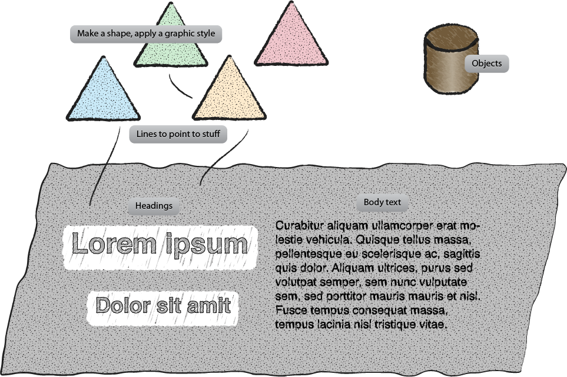

==================================
Illustrator Graphic Styles library
==================================

What is this
------------

This is 2 basic things:

#. An `Illustrator Graphic Style library <http://help.adobe.com/en_US/illustrator/cs/using/WS714a382cdf7d304e7e07d0100196cbc5f-61c7a.html>`_
#. An Illustrator file to get you started

Why do architecture with Illustrator?
-------------------------------------

It's freeform.  You aren't restricted to a stencil or one set of objects.  The
problems comes that you tend to fiddle with colors, fills, strokes, text sizes
because Illustrator allows you to.
